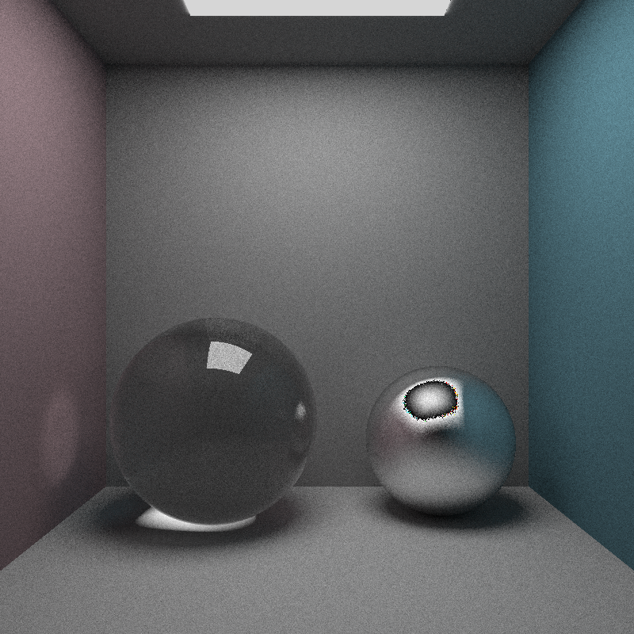
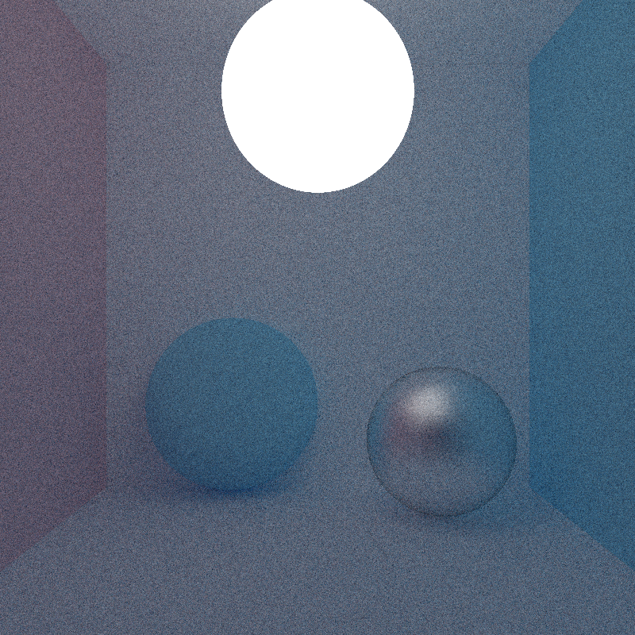
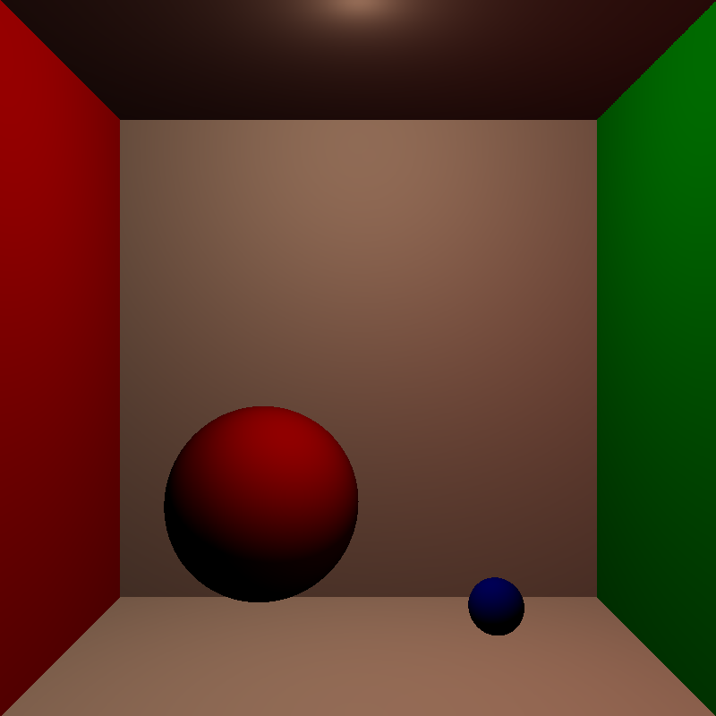
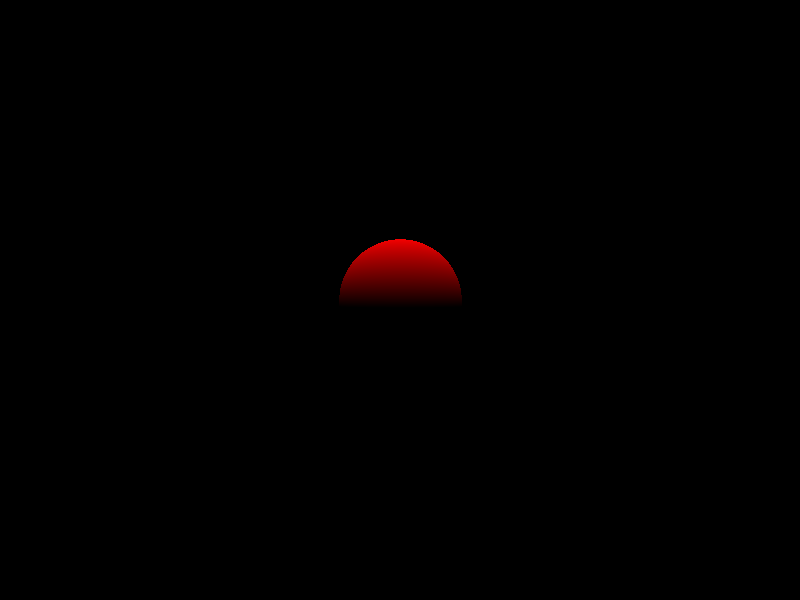

# Streamray
A small CPU raytracer written(mostly) during livestreams on twitch at https://www.twitch.tv/bellaedris

# Build
## Windows 
Install vcpkg and GLM, GTest. If using clion or similar non-visual studio build systems, add this argument to the cmake build:
`-DCMAKE_TOOLCHAIN_FILE=<vcpkg-root>/scripts/buildsystems/vcpkg.cmake`

## Linux
Install all required packages via `apt` or any package manager: 
 `libglm-dev`, `libgtest-dev`
# Results this far

## Stream 4
I broke my own rules and haven't started a stream for this step. Still, there is now a PDF concept
to create classes that can evaluate a PDF. This allows us to select a sampling strategy for our rendering. Cosine-weighed
is our go-to option for the moment.
Also i added Triangle intersection to get rid of this awful sphere lamp.

## Stream 3
Refactored the material system, added scattering of rays logic, emissive and metallic/glass materials

## Stream 2
Added a plane primitive, a scene representation and basic point lights.

## Stream 1
Mostly setup and configuration work. Includes glm lib and gtest for automated tests.
Very basic ray tracing setup: we send rays through a camera that has a fixed resolution and a viewport in the world. 
The scene is an array of simple sphere objects that we check with each ray sent through our camera. The colors are hard
coded.
